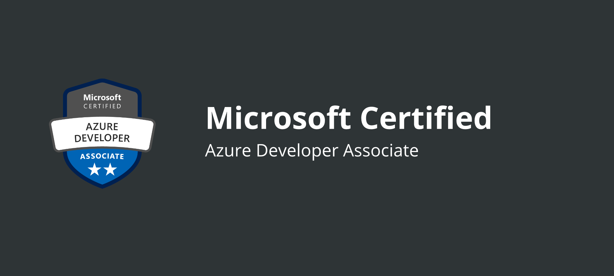

## Target: To prepare and clear AZ-204 Certification Exam and for that I should be proficient in Azure SDKs, data storage options, data connections, APIs, app authentication and authorization, compute, and container deployment, debugging, performance tuning, and monitoring.

# Day-1:-

## Skills measured during the exam :-
* Develop Azure compute solutions
* Develop for Azure storage
* Implement Azure security
* Monitor, troubleshoot, and optimize Azure solutions
* Connect to and consume Azure services and third-party services

## Azure Overview
* Compute
* Devops 
* Storage
* Networking
* Analytics
* Integration

But for most of the application we need three core elements:-
* Compute
* Storage
* Networking

## Compute
Compute contain :-
* Azure VMs
* Azure App Service
* Azure Container Instances
* Azure Kubernetes Service
* Azure functions
 
## Storage
* Azure Blob Storage
* Azure File Storage
* Azure Data Lake Storage
* Azure SQL Database
* Azure DB for Open Source
* Azure Synapse Analytics
* Azure Cosmos DB
* Azure Cache for Redis
* Azure Cosmos DB

## Networking 
* Vnet
* Subnets
* Vnet Perring
* Azure VPN
* Azure Express
* Route

we will cover the above topics in depth in the upcoming days. 

# Day-2:-

# Service Categories

## Migration
i. Azure Migrate:-
   * It discovers your on-premises servers, both physical and virtual.
   * Then it assesses these machines.
   * For each one, it tells you whether or not it's ready to migrate, how big the Azure VM will be, how much it will cost, and any dependent servers that will also need to be migrated. When you're ready, it will even help you do the migration.

ii. Azure Active Directory
   * This is a managed identity service that takes care of authentication.
   * there are many options for synchronizing your on-premises directory with your Azure directory.

## DevOps

i. Azure DevOps
   * It helps you to  automate large portions of the building, testing, and releasing of application updates.

ii. Azure Pipelines
   * It lets you create automated workflows to continuously build, test, and deploy code.

iii. Azure DevTest Labs
   *  It makes you easy to spin up non-production environments. You could do this in other ways, but DevTest Labs gives you some extra capabilities, such as allowing administrators to control costs by setting limits on how many VMs can be deployed at once and ensuring that VMs are shut down when they're not in use.
   
iv. Azure Content Delivery Network
   * which lets you take advantage of Microsoft's extensive global network. 
   *  It caches your most frequently accessed content in locations around the world so your end-users will retrieve it from the closest point on the network. This really helps with making your web applications feel more like local applications.

## Internet of Things
i. Azure IoT Central
  * It is a fully managed SaaS solution that takes care of the technical details for you. It lets you create IoT applications without writing any code. 

ii. Azure IoT Hub

 * It's a service that handles secure communications with thousands, or even millions, of IoT devices. In fact, it's the service that IoT Central uses behind the scenes.

iii. Azure Sphere 

 * It make your IoT devices more secure.
 * It includes certified chips, the Azure Sphere operating system, and the Azure Sphere Security Service, all of which provide layers of protection for your IoT devices.

##  Analytics
i. Azure HDInsight
 * It supports a wide variety of open-source big data frameworks, including Hadoop, Spark, Hive, Storm, and many others.

ii. Azure Databricks 
 * It is a similar service because it runs Spark as well, but it's more user-friendly and easier to manage than HDInsight.
 
iii. Azure Synapse Analytics
 * It is the new version of Azure SQL Data Warehouse. It includes all of the old data warehouse functionality, but it also supports Spark analytics. 

## Artificial Intelligence 
 
i. Azure Cognitive Services
 * This is a collection of pre-built artificial intelligence tools. These services let you add AI capabilities to applications even if you don't know anything about machine learning.

ii.  Azure Bot Service
 * It gives you the tools to create a chatbot. This is an intelligent agent that can answer questions. For example, you could create a chatbot to handle simple support requests from customers.

iii. Azure Machine Learning Studio
 * It lets you train and deploy machine learning models without any coding, using a drag-and-drop interface. I highly recommend it for learning the basics of machine learning. 

iv. Azure Machine Learning Services
 * It gives you full control over every stage of the machine learning process. 
 * You can use any Python-based machine learning framework, such as TensorFlow or PyTorch, train models using services such as Azure Databricks, and deploy models using services such as Azure Kubernetes Service.
 * Azure Machine Learning Services is usually the best solution when you need to build your own custom artificial intelligence application.

## Integration Tools
i. Azure Logic Apps
 * It lets you automate this sort of task without writing any code. 
 * You can create a logic app using a drag-and-drop interface. 

ii. Azure Event Grid
 * It is use to notify your logic app of particular event.
 * For example, if you want to get an email every time a virtual machine is created in a subscription, then you would configure Event Grid to send a message to your logic app whenever this occurs.

## DAY:-3

# Managing Services

i. Azure Monitor 
 * It's a collection of a variety of monitoring tools. 
 * the core features of Azure Monitor are metrics and alerts.
 * Metrics are basically statistics on various aspects of your resources, such as CPU usage on virtual machines and space used on Blob Storage.
 * It can also watch critical metrics you specify and send you an alert if there's a problem. 

ii. Azure Backup
 * Azure VMs are a little different because you back them up using a service called Azure Backup. 
 * you can even use this service to back up your on-premises systems.

iii.  Azure Advisor
 * It will not only suggest ways to improve the performance and availability of your applications, but it will even suggest ways to reduce your costs.
 * Azure Advisor also provides security recommendations. 

 iv. Microsoft Defender for Cloud
 * It was formerly known as Azure Security Center.
 * It’s a dashboard that gathers security information from resources across your subscriptions and assesses your vulnerabilities.

v. Azure Policy
 * It helps you to create your own custom policies from scratch in a service.

vi. ARM template
 *  ARM is short for Azure Resource Manager.
 * you create an ARM template that specifies all of the configuration details for one or more resources. 
 
vii. Azure Blueprints
 * A blueprint is a collection of ARM templates plus a few other details, such as policies and user permissions. 
 * When a blueprint is assigned to a subscription, it not only automates the creation of an environment, but it also keeps a record of the deployment.

## DAY:- 4

# Introduction to Azure App Services

 * App Service tries to make deploying a web application as easy as possible while still providing lots of flexibility and features.
 * It’s considered to be a platform-as-a-service rather than infrastructure-as-a-service because it manages the underlying infrastructure.
 * App Service supports a wide variety of programming languages and frameworks, including ASP.NET, ASP.NET Core, Java, Ruby, Node.js, PHP, and Python.
 * For most of these frameworks, you can choose whether to run it on Windows or Linux although that’s not the case with ASP.NET Framework 4.8, which can only run on Windows.
 * Even if you want to use a different programming language, you can still use App Service if you put your application in a Docker container that has the right dependencies installed in it.
 * high availability
 * scalability, so that you can configure it to automatically add more resources to your application when demand increases.
 * security ,it also provides authentication capabilities if you only want authorized users to be able to access your apps. 
 * It also lets you control which IP addresses are allowed or denied access to your site if you want.

## DAY:- 5

# Creating a Simple Web App

 * There are a few different options for where we could deploy it from,We could use Visual Studio, Visual Studio Code, or the Azure Command-Line Interface. I’m going to use the Azure CLI because it’s possible to use it without having to install anything. Microsoft provides something called the Cloud Shell that brings up a small virtual machine that has the Azure CLI and other tools installed on it.
 * Before we can deploy an app, we need to get one from somewhere, I’m going to use a sample .NET application.
 command-dotnet new webapp -n MyFirstAzureWebApp -f net6.0 && cd MyFirstAzureWebApp.
 * we can deploy it to App Service using this command.[az webapp up --sku F1 --name <app-name>],“az” means it’s an Azure command, “webapp” is the command for App Service,“up” tells it to create the web app using the code in the current directory, “sku F1” means that we want to use the free tier so we won’t be charged for this service, “--name”what we want to call the app and name has to be unique among all of the App Service names across all Azure customer.
 * There are quite a few other options we can add,Some of the other most common options are:
   * --resource-group for the resource group that it will put your App Service instance in.
   * --location to specify the Azure region where your app will be hosted.
   * --plan to specify which App Service Plan to use.
   * -os-type, which can be either Windows or Linux. If you don’t specify one, then it’ll default to “Windows”.

 * Now, suppose we wanted to make a change to the app.Go to editor,go into the MyFirstAzureWebApp folder, and then go into the Pages folder, which is where we’ll find the home page for our app. It’s called Index.cshtml,there we can customize the main text on the home page. To update our app, we’ll use the “az webapp up” command again, but this time, we don’t need to specify the sku or the name.

## DAY:- 6

# App Service Plans

 * The three main settings you have to choose in an App Service Plan are:
   * operating system
   * region
   * pricing tier
 *  operating system can be either Windows or Linux.
 *  For the region, you typically choose the one that’s closest to where most of your users are located,Bear in mind that you can’t change a service plan’s region.So if you decide to move an app to another region later, you’ll have to make a copy of it and put it in a new App Service Plan.
 * Types of pricing tier :-
   * Free tier
   * Shared tier
   * Basic tier
   * Standard tier
   * Premium tier
   * Isolated tier

 * The Free tier is a good choice as long as you only need 60 
  CPU minutes per day. If you need more CPU time than that, 
   then you’ll have to go with a plan that costs money.
 * Shared tier, which is also known as the D1 tier. It gives 
  you up to 240 CPU minutes per day. It’s called the Shared 
   tier because you have to share compute resources with 
    other Azure customers. That’s the case with the Free tier 
     as well. Both of these tiers have just one gig of RAM 
    and one gig of storage, so you can’t do too much with 
    them. The Shared tier also allows you to use a custom 
    domain name for your app’s website, which isn’t 
    something you can do with the Free tier.
 * Basic tier, which puts your apps on dedicated virtual machines instead of shared VMs. There are several options that vary based on the number of virtual CPU cores and the amount of memory. All of the options come with 10 gig of storage.
 * Standard tier,  it has 50 gig of storage instead of 10 gig, the CPU and memory options are exactly the same as the Basic tier. The big difference is that the Standard tier supports autoscaling, which means it can automatically add more virtual machines to handle increased traffic. It lets you use up to 10 VM instances. That’s significantly more than the Basic tier, which has a maximum of 3 VM instances.
 * The Premium tier has options for more CPU, memory, and storage, and it lets you use up to 30 VM instances in most Azure regions.
 * The Isolated tier gives you a private, dedicated environment that’s in its own virtual network. While the Standard and Premium tiers allow you to connect your dedicated VMs to a virtual network, the Isolated tier actually puts your VMs in a private virtual network so they’re isolated from other App Service instances. It lets you have up to 100 VM instances.
 * It’s possible to put multiple apps in your service plan, But all of those apps will share the same compute resources, so if you put too many apps in the same service plan, then you’ll run into performance issues.
 * One way to resolve this problem would be to add more virtual machine instances up to the limit of the number of instances allowed in the pricing tier you’ve chosen. This is known as scaling out.
 * second way you can switch your plan to a pricing tier that has more powerful instances and/or a higher limit on the number of instances you can have. This is called scaling up.

## DAY:- 7

# Autoscaling on Azure App Service

 * If you need to add more resources to an app running on App Service, one way is to scale up its resources by switching its App Service Plan to a higher pricing tier. This is very easy to do, and it only takes a few seconds, but it’s not a very dynamic solution.
 * Adding more virtual machines when your app is busier and remove VMs when it’s less busy. This is known as scaling out and scaling in rather than scaling up and scaling down. It’s only available on Basic plans and higher. It’s not available on Free or Shared plans.
 * Basic tier probably won’t give you what you need. That’s because it only allows you to scale in and out manually. If you want Azure to scale without manual intervention, then you need autoscaling, which is only available on Standard plans and higher.
 * The service that actually handles autoscaling is Azure Monitor. You can get to the autoscale settings either by selecting “Scale out” from the menu in your Service Plan or by going to Azure Monitor and selecting “Autoscale” and then selecting your Service Plan.
 * you can create one or more scale conditions that specify exactly what will trigger Azure to add or remove virtual machines. In each scale condition, you need to add one or more rules. 
 * cool down period-This is the number of minutes to wait after a scaling operation before it can scale again. By default, it’s set to 5 minutes. This gives the metrics a chance to stabilize again after the scaling operation.

## DAY:-8

# Deployment Slots in Azure App Service

 * deployment slot:- a testing environment that’s as close as possible to your production environment.
 *  By default, an app has one deployment slot called “Production”.
 * But you can create other deployment slots, too  like “testing” and “staging”. Then when you deploy an app, you can choose which deployment slot to put it in.
 * STEPS:-
   * you clone your production slot to a staging slot.When you do this, you can choose to clone the production slot’s configuration, including app settings, connection strings, the language framework, and many other settings. 
   * That way your staging slot’s configuration will be as close as possible to your production slot’s configuration, which will make your testing more valid.
   * Once you’ve cloned the slot to a new one, though, you can change any of those settings in the new slot if you need to. 
 * Note that if you use the command line to upload the app to the staging slot, you can’t use the “az webapp up” command. Instead, you have to use the “az webapp deployment source” command.
 * next step is to swap the staging slot with the production slot. You start by setting the source slot and the target slot.
 * The source slot contains the new version of the app, so it’s the staging slot.
 * The target slot is the one that will be running the new version once the swap has been completed, so it’s the production slot.
 * After the swap the source and target slots, it swaps not only the two different versions of your app but also any settings that you changed in the staging slot, such as the language framework if you changed that.
 * Aside from giving you the ability to properly test a new version before putting it into production, there are a couple of other big advantages to using a swap to deploy an app.
 *  First, when you deploy a new version of an app, it will often cause a reboot of the virtual machines that are used to host the app. During the warm-up period when the VM instances are spinning up, the app is not available, so if you were to simply deploy the new version of the app to production, it would cause downtime. But if you deploy to a staging slot first, then the VM instances have a chance to warm up before you swap the slot with production.
 * Second, if there’s a problem after you swap the new version into production, you can easily roll back and revert to the previous version. All you have to do is swap the two slots again. If you’ve ever had to quickly roll back a new version that you’ve deployed, then I’m sure you can appreciate how helpful this feature is.
 * swap with preview”:- This does the swap in two phases. First, it temporarily copies the slot-specific settings from the target slot (that is, the production slot) to the source slot (that is, the staging slot). It then gives you a chance to test the new version of the app with all of the settings it will have after the swap is completed.
 * If it doesn’t work, then you can cancel the swap. If it does work, then you can tell it to complete the swap. At that point, it swaps the app and the other settings between the two slots. But it leaves the slot-specific settings with each slot. So the version of the app that was previously in production and is now in the staging slot has the connection string for the test database.

## DAY:-9

# Deploying And Monitoring Azure App Service Web Apps

 i. Logging in to the Microsoft Azure Portal

 ii. Creating an Azure App Service Plan
   * In the search bar at the top of the Azure Portal, enter 
    app service plans. Click App Service plans under 
     Services.

   * Click + Create to create a new App Service plan.

   * In the Create App Service Plan form, enter the following 
    values and accept the defaults for the rest:
     * Resource Group
     * Name
     * Operating System
     * Location
 * Click on Change size under Pricing tier and, in the blade 
  that appears, click See additional options to reveal the 
  different tiers and their respective features.
 * Select the S1 tier and click Apply.
 * Click Review + Create and then Create to create the App 
  Service plan.

 iii. Creating a Web App in Azure
 *  In the search bar at the top of the Azure Portal, enter 
  app services. Click App Services under Services.
 *  Click + Create to create a new App Service.
 * In the Web App form, enter the following values and accept 
  the defaults for the rest.
 * Move onto the Monitoring section and enter the following 
  values:
    * Application Insights: No (this can be enabled after 
     creation)
 * Click Review + create and then Create.
 * Once the Web App is created, click Go to resource to view 
  its Overview blade,there you can Observe the information 
  available in the Overview blade.

 iv. Creating a Staging Deployment Slot
 * In the App Service blade, click Deployment slots under the 
   Deployment section,The production deployment slot is 
   available by default.
 * Click + Add Slot.
 * Enter the following values in the Add a slot form:
    * Name: staging 
    * Clone settings from: Do not clone settings
 *  Click Add to create the slot.
 *  Click Close on the Add a slot blade.
 *  Click on the staging slot.
 *  Click on Browse in the command bar to open the default 
    application deployed in the staging slot.
 
 v. Deploying a Web App Using Deployment Slots

 *  Download the pre-built application zip file that you will 
   deploy to the staging slot.
 * From the staging slot's App Service blade, enter advanced 
   tools in the search bar and select Advanced Tools under 
   Development Tools.
 * In the blade that appears, click Go to open the Advanced 
  Tools interface.
 * From the Kudu toolbar, click Tools > Zip Push Deploy.
 * Drag and drop the zip file onto the directory contents 
  table to kick off a Zip deploy.
 * Close the Kudu browser tab.
 * Click Browse on the staging slot's Overview blade to 
  navigate to the Web App.
 * Open the staging slot's Configuration blade.
 * Under the Application settings section, click + New 
  application setting and enter the following values before 
   clicking OK.
    * Name: test-setting
    * Value: blue
    * Deployment Slot Setting: Checked
 *  Click Save at the top of the blade followed by Continue to save the app setting.
 *  Refresh the staging slot Web App's homepage to see the change reflected.
 *  From the Deployment blade, click Deployment Slots > Swap.
 * In the Swap form, enter the following values:

    * Source
    * Destination
    * Perform swap with preview: checked
 * Click on Start swap for starting the swap operation.
 * Click Complete swap to finish the swap after approving the preview.
 *  Close the staging blade and Browse to the production slot's Web App to confirm the swap completed.

 vi. Monitoring Azure Web Apps
  *  On the Overview blade of the production Web App, click on one of the charts to open a Metrics blade.
  * Click the x beside the currently plotted metric to remove it from the chart.
 * Click Add metric and select Connections from the Metric drop-down menu.
 * Click the checkmark to confirm your metric selection.
 * Repeat the previous procedure to add the following metrics to demonstrate multi-metric charting:

    * HTTP 2xx
    * HTTP Server Errors
    * Thread Count 
 * Close the Metrics blade.
 * Scroll down the sidebar menu and select Monitoring > App Service Logs.
 * Set the following values:

    * Application Logging (Filesystem): On
    * Level: Verbose
    * Web server logging: File System 
    * Quota (MB): 35
    * Retention Period (Days): 0 
 * Click Save.
 * Click Log stream under Monitoring in the sidebar to view the application and web server logs in near real-time from the Portal.
 *  Refresh the production Web App browser tab to generate some logging activity.
 *  Wait up to a minute for the verbose application logs to appear in the streaming log console.
 * Click Web server logs in the Log stream blade to switch to view web server logs.
 * Refresh the production Web App browser tab, and wait up to a minute for the web server logs to appear in the streaming log console.
 * Scroll down to the Support + Troubleshooting section of the sidebar menu, and click Resource health.

 vii. Monitoring Application Performance With Application Insights
 * In the search bar at the top of the Azure Portal, enter app insight. Click Application Insights under Services.
 *  Click + Create to create a new Application Insight resource.
 *  In the Application Insights form, enter the following values and accept the defaults for the rest:

    * Resource Group
    * Name
    * Region
    * Resource Mode
 *  Click Review + create and then Create.
 * Once complete, return to the production Web App and on the app blade's sidebar menu, click on Application Insights under the Settings section.
 * Click Turn on Application Insights and in the Application Insights form, under Link to an Application Insights resource, click the Select existing resource button.
 * Select the app insight resource created earlier with a name similar.
 *  Click Apply and click Yes.
 * Click on the View Application Insights Data link.
 * Refresh the production Web App's browser tab, and click on a few of the different links in the header to generate some request data.
 * Click on Search in the command bar located above of the Essentials drop-down.
 *  Enter home in the search bar.
 * Go back to the Overview page and click on Logs in the menu bar,Log Analytics allows you to run SQL-like queries over the information tracked by Application Insights.
 * Close the internal welcome window first and then close the example query welcome page.
 * Double-click pageViews to generate a query for all page views.
 * Click RUN to execute the query.
 * Click Chart to see a chart view of results.
 *  Click Chart formatting on the right side of the chart and make the following changes in the drop-down menus to show the total page views for each page:

    * Change the x-axis from timestamp to name
    * Change the y-axis from duration to itemCount
    * Change the split by from id to url
 * In the sidebar menu, click on Performance under the Investigate section to see performance monitoring data.
 *  Close the Application Insights blade.

 ## DAY:- 10

 # Deploying Code From GitHub to Azure App Service

  By using the  Azure Cloud Shell-
  * For creating a resource group we have to use  the “az 
   group create” command. Add the name parameter  for “webapp 
   resource group”. Then add the location parameter and 
   specify an Azure region.
  * now we need to create an App Service plan using the “az 
   appservice plan create” command.Add the name parameter 
   ,the resources group.For the location, we’ll use the same 
   region as we did for the resource group and then we have 
   to specify the SKU, which means the pricing tier for the 
   App Service Plan. F1 is the free tier, so we won’t have to 
   pay anything.
 * Now we need to create a webapp in the plan. This will 
  essentially be a place to put our app when the time comes, 
  so when we first create the webapp, it’ll be empty.Use the 
   “az webapp create” command. The name has to be globally 
   unique.Then tell it to use the resource group and the App 
   Service plan we just created, which we called asplan.
 * we need to deploy the app, the command we need is “az 
  webapp deployment source config”., we can use the “repo- 
 url” parameter to tell it where the GitHub repository is. 
 This is the URL for the “html-docs-hello-world” sample app.
 * we need to specify the “manual-integration” parameter.This 
  means that we’re deploying the code manually rather than 
 telling it to automatically deploy the app every time the 
  code changes.
 * Then the name of the webapp where we want to deploy the 
  code and  which resource group the webapp is in.
 * If you want to configure continuous deployment, which is 
  where the app automatically gets deployed every time the 
  code in the repository changes, then Microsoft recommends 
   using the Azure Portal.

 ## DAY:-11

 # Configuring Networking in Azure App Service 

 * Introduction
    * creating custom domain name for  an app
    * Enabling TLS/SSL 
      * so we can reached with HTTPS
    * Inbound and Outbound Connections

* Custom Domains 
     * you need to make sure your App Service Plan is using a paid tier because custom domains are not supported in 
      the free F1 tier. 
     *  go into the Custom Domain settings for your app in App Service and find the Custom Domain Verification ID. This is something that you’ll add to your domain records to prove to Microsoft that you own the domain.
     *  Copy the verification ID and paste it into a text 
     editor. 
     * You’ll also need to copy the IP address of your app and the existing URL of the app from the Custom Domains page. The existing URL will end in 
     “.azurewebsites.net”. Paste both of these values into 
     a text editor as well.
     * Now go to your domain provider’s website and open your DNS records .If you’re going to use a root domain, for your app, then create an A record. 
     * In the A record, set the name to ‘@’ (which means the 
      root domain), and set the value to the IP address of 
      your app. In the CNAME record, set the name to the 
      subdomain, such as www, and set the value to the 
      existing URL of your app.
     * Now to prove to Microsoft that you own this domain and its subdomain, you need to create a TXT record for each of them. A TXT record is just an informational record that doesn’t affect the resolution of your domain name.
     *  For the root domain, set the name to asuid, which I’m assuming stands for “App Service Unique Identifier”, and set the value to the Custom Domain Verification ID that you copied from App Service. For the subdomain, set the name to asuid dot and the subdomain,And set the value to the Custom Domain Verification ID.
     * Now you need to go back to the Custom Domains page for your App Service app and add your custom domain.You just need to put in the name of the domain and the DNS record type, which will be either A or CNAME, depending on whether you’re adding the root domain or a subdomain. 
     * Then you click the “Validate” button, and Azure checks for the DNS records that you added. If it works, then your app is now accessible using your custom domain name.

  
 ## DAY:-12

 # Enabling TLS/SSL
 * after creating custom domain for your app, it will only be accessible at a URL starting with “http”, which is an insecure protocol.These days, every website should be able to respond to requests over HTTPS, which is the secure version of HTTP.To set that up, we need to enable TLS/SSL
 * we need to make sure that the tier of your App Service Plan is at least Basic because the Free and Shared tiers don’t support TLS/SSL for custom domains.
 * we need to have a TLS/SSL certificate file. This type of file contains a private key and a certificate with a public key. These are needed for a couple of reasons. 
    * First, the public/private key pair is used to encrypt and decrypt traffic between the website and the browser of anyone visiting the site.
    * Second,The certificate verifies that the browser is interacting directly with the website,it helps prevent something called a man-in-the-middle attack.
    * Third,you need to create a TLS binding to your custom domain.
 * how to get get a certificate file- The easiest way is to use the free App Service managed certificate. It’s provided by Digicert, which is the certificate authority that verifies the authenticity of the certificate. This solution won’t work in all cases, but it works for most situations, and it’s free.
 * To create a free certificate, go into the TLS/SSL settings for your App Service app, then select Private Key Certificates, and click Create App Service Managed Certificate. Then tell it which custom domain you want to create the certificate for.
 * Once you have a private key certificate, whether it’s a free one or one that you imported from elsewhere, then you can bind TLS/SSL to your domain.
 * Other than specifying the custom domain and the certificate, you need to tell it whether to use SNI SSL or IP SSL. SNI SSL binds the certificate using the website’s hostname, while IP SSL binds the certificate to the website’s IP address. SNI SSL gives you more flexibility, and it’s easier to configure, so it’s usually the best choice ,The only disadvantage is that it doesn’t work on really old browsers.
 * Once you’ve bound your certificate to your custom domain, people will be able to access your app using HTTPS.
 * However, they’ll still be able to access it using HTTP, which is not encrypted, so if you want to ensure that everyone will access your site over HTTPS, then we can select the “HTTPS only” option in your app’s TLS/SSL settings.
 * one of the benefits of binding a certificate to a custom domain is that it lets a client device know that it’s communicating with a legitimate website and not a hacker. But the website has no way of knowing that’s it’s communicating with a legitimate client and not a hacker. If you require that level of security, then you can enable TLS mutual authentication. This is also known as client certificate authentication. 

 ## DAY:-13

 # Inbound and Outbound Connections

 There are many different ways to connect to or from an app, depending on exactly what you need to do. These methods can be divided into two groups: 
 * inbound (for connecting to an app) 
 *  outbound (for connecting from an app to other resources).

 * Inbound Connection :-
  * you want to restrict which IP addresses can connect to it, then the easiest way to do that is to add access restriction rules to your app. Each rule either allows or denies access to a single IP address or a block of IP addresses.
  * If you have resources in an Azure virtual network that need to connect to your app over the Microsoft backbone network rather than over the internet, then you can restrict access to your app using a service endpoint rather than an IP address. 
  * A service endpoint is something you can enable on a subnet. So you can create a service-endpoint-based rule that allows access to your app from a particular subnet in a VNet.
  * A newer way of doing this is to create a private endpoint for your app. This is a private IP address in your VNet that gets attached to your app.
  *  One advantage of using a private endpoint is that it makes it easy to connect to your app from an on-premises environment. If you already have a connection from your on-premises environment to your Azure VNet using a method such as Azure ExpressRoute or Azure VPN,then you can connect to the app through the private endpoint in the VNet. 
  * This is more difficult to do with a service endpoint. For this and other reasons, Microsoft recommends using private endpoints rather than service endpoints.

  * Outbound Connections:-
  *  An outbound connection is typically used to connect an app to a database or other type of supporting resource.
  * App Service Hybrid Connections is a feature that allows an app to connect to a resource in an Azure virtual network or an on-premises environment. To make it work, you need to install Hybrid Connection Manager on a Windows Server that has access to both networks over port 443. App Service then uses this as a relay to connect to the other environment.
 * The advantage of using Hybrid Connections is that it provides secure access even if you don’t have an ExpressRoute or VPN connection between your on-premises environment and Azure.
 * Another method is called VNet Integration. There are two different types: Regional VNet Integration and Gateway-required VNet Integration.
 * The great thing about the Regional method is that you don’t need to install anything.
 * To configure it in App Service, we can go into the Networking section of your app’s configuration and select VNet Integration. Then we just need to tell it which VNet we want to add. If the VNet that you want to integrate with is in the same region as the app, then the only requirement is that the VNet has to have an empty subnet that the Integration feature can use.
 * Once we’ve configured Regional VNet Integration, then your app can connect to resources in the VNet or in an on-premises network that’s connected to the VNet through ExpressRoute or a VPN. It can even connect to a VNet in a different region if there’s a peering connection between that VNet and the regional VNet.

 ## DAY:- 14

 # Running a Container on Azure App Service

 * demonstration of how to build and run a Docker container on App Service-

 * A Docker container is a self-contained software environment that includes an application and all of its dependencies. Because it includes everything it needs, the container is portable. That is, it can run on any system that supports Docker without having to worry about what’s installed in the underlying operating system.

 * Container images are normally stored in a central location, which makes it easier to manage them and deploy them. Microsoft offers a service called Azure Container Registry that provides this central location.

 * To deploy a container to App Service-
    * create an instance of Azure Container Registry. Then build a container image. 
    * upload it to your container registry. Then deploy it from the container registry to Azure App Service. 
    * try to connect to the application to make sure it worked
 * step 1 descrp-
    *  we’ll create the container registry. In the Azure Portal, type “container” in the search bar, and choose “Container registries”. Then click “Create”. 
    * When it’s done, click “Go to resource”. Then go to “Access keys” and set “Admin user” to “Enabled”. This is required for deploying to App Service.
 * step 2 descrp- 
    * we need to build the container image, so we need to have Docker installed and running on your desktop.
    * Once you have Docker running, you can build the container image in a variety of different ways, but we’re going to do it from Visual Studio Code,You’ll also need to install the Azure Tools extension. To install it, click on Extensions, search for “azure”, and install Azure Tools. 
 * we need to create a Dockerfile, which is a file that tells Docker how to build a specific container. we’d need to type some instructions that tell Docker what base image to use and how to install our application and all of its dependencies.
 * Build the container image.
 * Now we’re going to push the image to the container registry. Click the Docker logo. The image name shows up here. If you click on it, the “latest” tag appears, which means this is the version of the image that we just built. Now, right-click on the image and select “Push”. It brings up the image name and tag again up here, so hit “Enter”.
 *  To check that it worked, click the Refresh button next to “Registries”, and the image name should show up under your registry. If you click on it, the tagged version of the image is there.
 * container image is in our registry, we can finally deploy it to Azure App Service. Right-click the tagged image, and select “Deploy image to Azure App Service”. 
 * Finally, select an App Service Plan. If you haven’t created one already, then you can create one from here. The pricing tier for your service plan has to be at least Basic because you can’t deploy a container to a Free plan.

 ## DAY :- 15

 # Building Containers with Azure DevOps

 * Docker Containers
     * As a software containerization platform, Docker offers developers a common toolset and packaging model. It also provides a deployment mechanism for containerized apps. This results in simplified management, regardless of the host, as well as a seamless DevOps experience.
     * Docker images can be created and deployed identically across virtually any environment in seconds. The Docker ecosystem is huge. 
     *  DockerHub, which is the Docker-maintained public containerized application registry, publishes almost 200,000 applications in the public community repository. 

 * Microservices and Containers-
 * The term “Microservices” refers to an application development strategy where each part of an application is actually deployed as a completely self-contained component (or microservice). The microservices that comprise an application can then be individually scaled and updated. 

 

 

   

 
 

 

   

